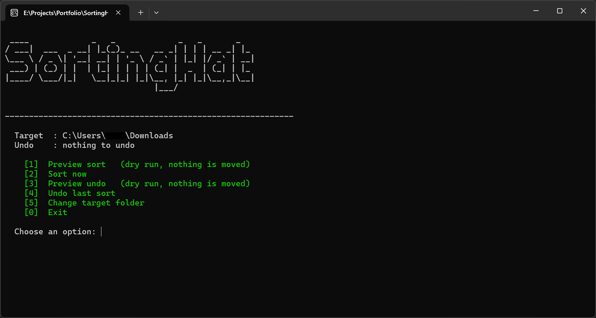
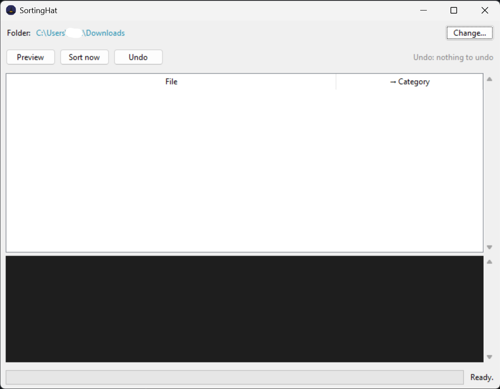

# SortingHat 🧙‍♂️

[](https://github.com/jeevanb93/SortingHat/releases/latest)
[](https://github.com/jeevanb93/SortingHat/blob/main/LICENSE)


SortingHat is a simple, lightweight Python CLI tool designed to bring order to the chaos of your messy folders (especially your `Downloads` directory). It automatically categorizes and moves files into organized subdirectories based on their file extensions.

Nothing is ever overwritten, every live run can be undone, and every action can be previewed first.

## Features

- **Desktop GUI**: An optional Tkinter interface (`sortinghat --gui`) with a folder picker, a live preview table, and Sort / Undo buttons — still with zero third-party dependencies.
- **Interactive Menu**: Launched with no arguments (or by double-clicking the `.exe`), SortingHat asks what you want to do instead of sorting straight away — preview, sort, undo, or change folder, each behind a number key, highlighted in green.
- **Automated Categorization**: Sorts files into logical folders like `Documents`, `Pictures`, `Videos`, `Music`, `Compressed`, `Installers`, `Torrents`, and `Misc`.
- **Smart Collision Handling**: If a file with the same name already exists in the destination folder, SortingHat safely renames the new file (e.g., `file (1).txt`) to ensure nothing is ever overwritten or lost.
- **Dry Run Mode**: Safely preview what files will be moved and where, without making any actual changes to your filesystem.
- **Undo Support**: Reverse sorting operations effortlessly in case of a mistake. Runs are stacked, so each `--undo` steps back one sort at a time, and it can be previewed with `--dry-run` first.
- **Custom Configuration**: Use a JSON file to add new categories or map additional file extensions.
- **Exclude Patterns**: Skip specific files using glob patterns (e.g., `--exclude '*.tmp'`).
- **Adjustable Verbosity**: Run silently with `--quiet` or get detailed logs with `--verbose`.
- **System File Filtering**: Automatically ignores dotfiles and OS artefacts like `desktop.ini` and `Thumbs.db`.
- **No External Dependencies**: Uses only the standard library — `argparse`, `fnmatch`, `shutil`, `pathlib` for the core, and `tkinter`, `threading`, `queue` for the GUI.

## Screenshots

| Interactive terminal menu | Desktop GUI |
| :---: | :---: |
|  |  |

## Download

Prebuilt Windows executables are available on the [**Releases page**](https://github.com/jeevanb93/SortingHat/releases) — **no Python required**. Grab the latest release and download the one you want:

| Download | What it is |
| :--- | :--- |
| **`SortingHat-GUI.exe`** | Desktop app — double-click for the graphical interface. |
| **`SortingHat.exe`** | Terminal app — the interactive menu and full command line. |

On first launch, Windows SmartScreen may warn about an unsigned app — choose **More info → Run anyway**, or, if you'd rather not trust a binary, [run from source](#running-it) or [build it yourself](#building-standalone-executables) (the whole tool is a single readable file).

> Prefer Python? Skip the download entirely and [run from source](#running-it) on any OS.

## Requirements

- **Python 3.8 or newer** (developed and tested on 3.14). No third-party packages are needed to run the tool.
- **Windows, macOS, or Linux.** The tool is cross-platform; only the prebuilt binaries are OS-specific (built with `build_exe.bat` on Windows, `build_app.sh` on macOS/Linux).

To run SortingHat you need nothing but the single `sortinghat.py` file. Everything below — installing, building an `.exe` — is optional convenience.

---

## Running It

There are three ways to run SortingHat. Pick whichever suits you; they all accept the same options.

### 1. Straight from the source file

No installation at all. From the project root:

```bash
python sortinghat.py
```

### 2. As an installed command

Install once from the project root:

```bash
pip install -e .
```

The `-e` (editable) flag means the command always reflects the current source, so you can keep editing `sortinghat.py` without reinstalling. Afterwards the `sortinghat` command works from any directory:

```bash
sortinghat
sortinghat "C:\Path\To\Your\Messy\Folder" --dry-run
```

To remove it later: `pip uninstall sortinghat`.

### 3. As a standalone `.exe` (Windows, no Python required)

**Download** a prebuilt `SortingHat.exe` (terminal) or `SortingHat-GUI.exe` (desktop) from the [Releases page](https://github.com/jeevanb93/SortingHat/releases), or [build them yourself](#building-standalone-executables). Once you have one, double-click it or call it from a terminal like any other command.

> Throughout this README, examples are written as `python sortinghat.py ...`. Substitute `sortinghat ...` or `SortingHat.exe ...` if you installed or built it — the options are identical.

---

## Usage

### The Interactive Menu

Running SortingHat with **no arguments** — including double-clicking `SortingHat.exe` — opens a menu rather than sorting immediately, so a stray launch can never move your files:

```
  Target  : C:\Users\you\Downloads
  Undo    : 69 file(s) from the last sort

    [1]  Preview sort   (dry run, nothing is moved)
    [2]  Sort now
    [3]  Preview undo   (dry run, nothing is moved)
    [4]  Undo last sort
    [5]  Change target folder
    [0]  Exit

  Choose an option:
```

Type the number and press Enter. Notes:

- The menu **stays open after each action**, so you can preview, sort, then undo without relaunching.
- The `Undo` line always shows exactly what option `[4]` would restore, including how many older runs are stacked behind it.
- Option `[5]` accepts paths with or without surrounding quotes; a blank answer keeps the current folder.
- Options are printed in green. Colour switches off automatically when output is piped or redirected, and can be disabled entirely by setting the `NO_COLOR` environment variable.

A typical safe session is `[1]` to preview, `[2]` to commit, and `[4]` if you change your mind.

**Forcing the mode:** use `--menu` to open the menu from a normal terminal, or `--no-menu` to sort immediately even with no arguments.

### The Desktop GUI

For a point-and-click experience, launch the graphical interface:

```bash
python sortinghat.py --gui
sortinghat --gui          # if installed
sortinghat-gui            # dedicated GUI launcher
```

The window gives you a folder picker, a **live preview table** (file → category) populated by a dry run, and **Preview / Sort / Undo** buttons, with a scrolling log and progress bar underneath. The `Undo` state is shown so you always know what an undo would restore.

It is built on Python's bundled Tkinter, so it needs **no extra packages**. Long operations run on a background thread, so the window never freezes on a large folder. If Tkinter isn't available in your Python build (some minimal Linux installs omit it), the terminal interface remains fully functional.

> On Windows, you can skip Python altogether and download **`SortingHat-GUI.exe`** from the [Releases page](https://github.com/jeevanb93/SortingHat/releases).

> **Architecture note:** the GUI does not reimplement any sorting logic. The engine emits typed events to a *reporter*; the CLI supplies a `ConsoleReporter` and the GUI a queue-backed `GuiReporter`, so both front-ends drive the exact same, fully-tested engine. See [`sortinghat_gui.py`](sortinghat_gui.py) for the layering.

### The Command Line

Passing any real instruction — a folder path, `--dry-run`, or `--undo` — skips the menu and does exactly what you asked.

#### Sort a specific folder
Pass the folder path as an argument. Use quotes if the path contains spaces:
```bash
python sortinghat.py "C:\Path\To\Your\Messy\Folder"
```

With no path given, SortingHat defaults to your user's **Downloads** folder:
```bash
python sortinghat.py --no-menu
```

#### Preview changes (dry run)
To see what the tool *would* do without moving anything:
```bash
python sortinghat.py --dry-run
python sortinghat.py "C:\Path\To\Your\Messy\Folder" --dry-run
```
The preview accounts for filename collisions, so the names it shows are the names you will actually get.

#### Exclude files
Use `--exclude` to skip files matching a glob pattern. The flag can be repeated:
```bash
python sortinghat.py --exclude "*.tmp"
python sortinghat.py --exclude "*.tmp" --exclude "Thumbs*"
```

#### Verbosity
By default, SortingHat prints each file it moves.
- `--quiet` suppresses per-file output, leaving only the final summary table.
- `--verbose` adds detail such as ignored system files, excluded files, and undo-log activity.
```bash
python sortinghat.py --quiet
python sortinghat.py --verbose
```

### What a Run Looks Like

```
  Moving  annual-report.pdf
       -> Documents/annual-report.pdf

  Moving  holiday-photo.jpg
       -> Pictures/holiday-photo.jpg

  Moving  invoice.pdf
       -> Documents/invoice (1).pdf (renamed to avoid collision)

------------------------------------------------------------

  Moved 69 file(s).

  Category                              Count
  --------------  --------------------  -----
  Compressed      [##------------------]  5
  Documents       [####################]  49
  Misc            [###-----------------]  8
  Pictures        [##------------------]  4
  Torrents        [#-------------------]  2
  Videos          [--------------------]  1
  --------------                        -----
  Total                                 69
```

The bars are scaled to the largest category, so you can see at a glance where the bulk of the clutter is.

---

## Undo

Every live run writes a hidden `.sortinghat_undo.json` log **into the folder it sorted**, recording where each file came from. Undo replays that log in reverse:

```bash
python sortinghat.py --undo
python sortinghat.py "C:\Path\To\Your\Messy\Folder" --undo
```

How it behaves:

- **Runs are stacked.** Each live sort appends a new entry, so sorting a folder repeatedly never destroys your earlier history. Each `--undo` walks back exactly one run — repeat it to keep unwinding.
- **The log is per-folder.** Undoing a sort of `Downloads` requires pointing `--undo` at `Downloads`.
- **Empty category folders are cleaned up** after a restore. Folders that still contain other files are left alone.
- **Files that have since been moved or deleted are reported and skipped**, never recreated.
- Once the last recorded run is undone, the log file is removed.

Undo can be previewed before you commit to it by combining it with `--dry-run`. Nothing is moved and the log is left intact:

```bash
python sortinghat.py --undo --dry-run
```

Because the log lives in the sorted folder, deleting `.sortinghat_undo.json` permanently discards the undo history for that folder.

---

## Custom Configuration

You can define your own file categories or add extensions to existing ones using a JSON config file. Keys are category (folder) names, values are lists of extensions:

```json
{
    "Code": [".py", ".js", ".ts", ".html", ".css", ".sql"],
    "Music": [".mid", ".midi"]
}
```

A ready-made `example_config.json` ships with the project. Pass it with `--config`:

```bash
python sortinghat.py --config example_config.json
```

Merge rules: a **new** category name creates a new folder; an **existing** category name has your extensions added to the built-in list rather than replacing it. Extensions are matched case-insensitively and should include the leading dot.

The config is validated when loaded. Category names must be plain folder names — no path separators, `..`, or drive letters — and each value must be a list of extension strings that each begin with a dot. A malformed config (for example `{"Code": "py"}` or `{"C:/Windows": [".pdf"]}`) is rejected with an explanatory error rather than silently doing the wrong thing.

---

## Command Reference

| Option | Description |
| :--- | :--- |
| `target_path` | Folder to organize. Defaults to `~/Downloads`. |
| `--dry-run` | Preview without moving anything. Combine with `--undo` to preview a restore. |
| `--undo` | Reverse the last sort in the target folder. Repeat to walk further back. |
| `--exclude PATTERN` | Glob pattern of filenames to skip. Repeatable. |
| `--config FILE` | JSON file that adds or extends extension-to-category mappings. |
| `--menu` | Force the interactive menu. |
| `--no-menu` | Sort immediately even with no arguments. |
| `--gui` | Launch the desktop (Tkinter) interface. |
| `--quiet` | Summary only. Mutually exclusive with `--verbose`. |
| `--verbose` | Extra detail: system files, exclusions, undo-log activity. |
| `-h`, `--help` | Show the built-in help. |

| Environment variable | Effect |
| :--- | :--- |
| `NO_COLOR` | Set to any value to disable coloured output. |

---

## File Categories

SortingHat maps extensions to the following categories:

| Category | File Extensions |
| :--- | :--- |
| **Compressed** | `.zip`, `.rar`, `.7z`, `.tar`, `.gz`, `.bz2`, `.xz`, `.zst` |
| **Documents** | `.pdf`, `.docx`, `.doc`, `.txt`, `.xlsx`, `.xls`, `.pptx`, `.ppt`, `.csv`, `.epub`, `.odt`, `.rtf`, `.md`, `.json`, `.xml`, `.pages` |
| **Installers** | `.exe`, `.msi`, `.dmg`, `.pkg`, `.deb`, `.rpm`, `.appimage` |
| **Music** | `.mp3`, `.wav`, `.aac`, `.flac`, `.ogg`, `.opus`, `.m4a`, `.wma`, `.aiff` |
| **Pictures** | `.jpg`, `.jpeg`, `.png`, `.gif`, `.svg`, `.bmp`, `.heic`, `.tiff`, `.tif`, `.webp`, `.ico`, `.raw`, `.cr2`, `.nef` |
| **Videos** | `.mp4`, `.mkv`, `.avi`, `.mov`, `.wmv`, `.webm`, `.m4v`, `.flv` |
| **Torrents** | `.torrent` |
| **Misc** | Any extension not listed above. |

Only files in the **top level** of the target folder are considered. Existing subdirectories, dotfiles, and OS system files (`desktop.ini`, `Thumbs.db`) are left untouched. **Symlinks are skipped**, so a shortcut is never followed and moved as if it were a real local file.

---

## Safety

SortingHat only ever operates inside the folder you point it at:

- **Nothing is overwritten.** Name clashes are renamed (`file (1).txt`); this holds even against a broken symlink already sitting at the destination.
- **Undo is confined to the target folder.** The undo log is a plain file in a directory that fills with untrusted downloads, so restores are validated: any entry whose source or destination falls outside the target is refused rather than executed.
- **Configuration is validated.** Category names that contain path separators, `..`, or drive letters are rejected, so a shared config can't redirect your files somewhere unexpected.
- **Symlinks are skipped** during sorting rather than followed.

---

## Building Standalone Executables

To run SortingHat on a machine without Python, build single-file Windows executables with PyInstaller.

**The easy way** — run the included script from the project root. It installs PyInstaller if needed, generates the app icon, and builds **both** the console and GUI executables:

```bash
build_exe.bat
```

**Manually**, if you prefer:

```bash
pip install pyinstaller
python tools\make_icon.py                                   # generates assets\sortinghat.ico

REM console / menu build
pyinstaller --onefile --name "SortingHat" --icon "assets\sortinghat.ico" sortinghat.py

REM desktop GUI build (windowed, no console)
pyinstaller --onefile --windowed --name "SortingHat-GUI" ^
  --icon "assets\sortinghat.ico" --add-data "assets\sortinghat.ico;assets" sortinghat_gui.py
```

You get two self-contained files you can copy anywhere:

| File | What it is |
| :--- | :--- |
| `dist\SortingHat.exe` | Terminal app — the interactive menu and full CLI. Built without Tkinter to stay lean (~8.6 MB), so `--gui` here points you to the GUI executable. |
| `dist\SortingHat-GUI.exe` | Desktop app — double-click straight to the graphical interface, no console window. |

(Running `--gui` from source still opens the window directly, since a normal Python install includes Tkinter.)

### macOS and Linux

The tool is pure standard library, so **running from source works on any OS** with no changes — CLI, menu, and GUI alike:

```bash
python3 sortinghat.py --dry-run      # preview a sort
python3 sortinghat.py --gui          # desktop window
```

To build standalone binaries, run the sibling script **on that machine** (PyInstaller can't cross-compile — a macOS app must be built on a Mac):

```bash
chmod +x build_app.sh && ./build_app.sh
```

On macOS this produces `dist/SortingHat` (terminal) and `dist/SortingHat-GUI.app` (desktop). The app is **unsigned**, so on first launch **right-click it → Open** once (or run `xattr -dr com.apple.quarantine dist/SortingHat-GUI.app`) — a one-time Gatekeeper prompt, not an error. Notarization for frictionless double-click launching is optional and requires a paid Apple Developer account; it is not needed to run or share the app.

### The application icon

Both executables use `assets\sortinghat.ico` for their taskbar and window icon. A placeholder wizard-hat icon is generated by `tools\make_icon.py` (pure standard library — no Pillow needed). To use your own, replace `assets\sortinghat.ico` with any multi-resolution `.ico` (16/32/48/256 px) and rebuild.

> The GUI also sets a Windows *AppUserModelID*, so the taskbar shows this icon rather than folding the window under the generic Python launcher.

### Using the .exe

- **`SortingHat-GUI.exe`** — double-click for the desktop window.
- **`SortingHat.exe`** — double-click for the interactive menu (stays open until you choose `[0] Exit`), or call it with arguments from a terminal:
  ```
  SortingHat.exe "C:\Path\To\Your\Messy\Folder" --dry-run
  ```

### Rebuilding

If a build fails with `PermissionError: [WinError 5] Access is denied` on `dist\SortingHat.exe`, a copy is still running — close any open SortingHat windows and build again. `build/` and `dist/` are safe to delete at any time; they are regenerated on the next build.

---

## Development

Install the development dependencies and run the test suite from the project root:

```bash
pip install -e ".[dev]"
python -m pytest
```

The suite covers categorization, collision handling, config parsing and validation, path-confinement safety, exclusions, the undo log format and stacking, empty-folder cleanup, colour fallback, the interactive menu, and the GUI's reporter/controller logic (headless).

### Project Layout

| Path | Purpose |
| :--- | :--- |
| `sortinghat.py` | The engine + CLI — a single, dependency-free module. |
| `sortinghat_gui.py` | The optional Tkinter GUI (App / Controller / GuiReporter). |
| `tests/test_sortinghat.py` | Pytest suite for the engine and CLI. |
| `tests/test_gui.py` | Headless tests for the GUI's reporter/controller logic. |
| `pyproject.toml` | Packaging metadata and the `sortinghat` / `sortinghat-gui` entry points. |
| `example_config.json` | Sample custom category configuration. |
| `assets/sortinghat.ico`, `.png` | Application icons (placeholder; replaceable). `.ico` for Windows, `.png` for the macOS/Linux window icon. |
| `tools/make_icon.py` | Regenerates the placeholder icons using only the standard library. |
| `build_exe.bat` | One-step Windows build script (console + GUI). |
| `build_app.sh` | One-step macOS/Linux build script (console + GUI). |
| `docs/screenshots/` | README screenshots. |
| `LICENSE` | MIT license text. |
| `SortingHat.spec`, `build/`, `dist/` | Generated on first build. Not tracked in git, and safe to delete. |

## License

Released under the [MIT License](LICENSE).
